# Onecore

### 浏览器支持

>  IE9+

### 功能介绍

* #### 栅格系统
  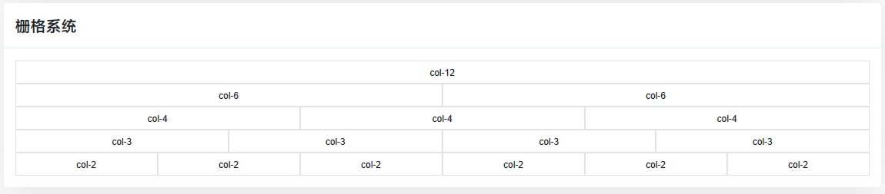
* #### Tip
  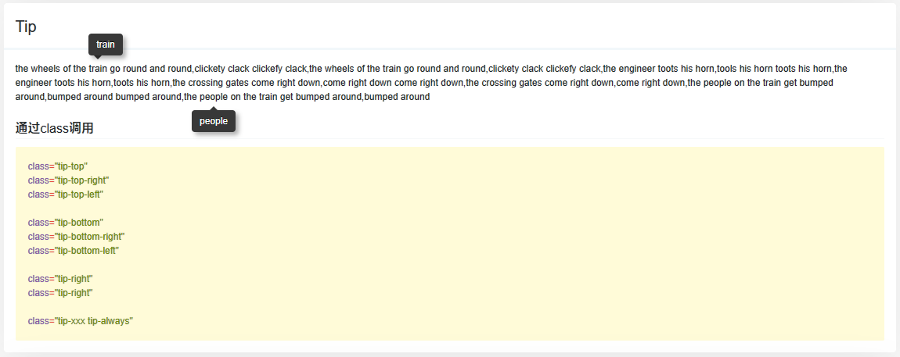
* #### Dropmenu
  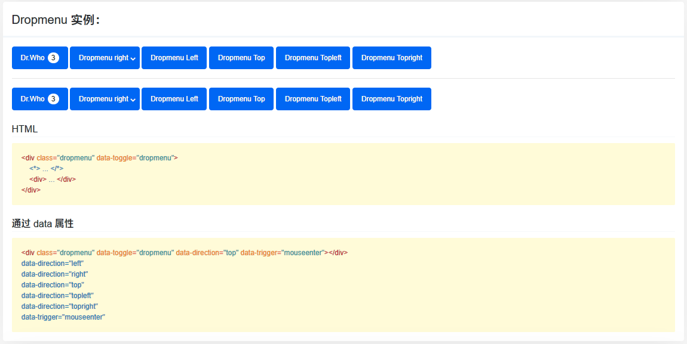
* #### Datepicker
  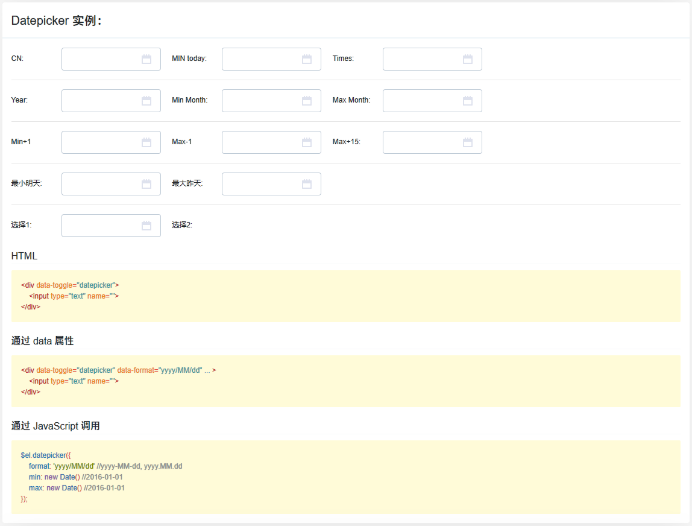
* #### Select
  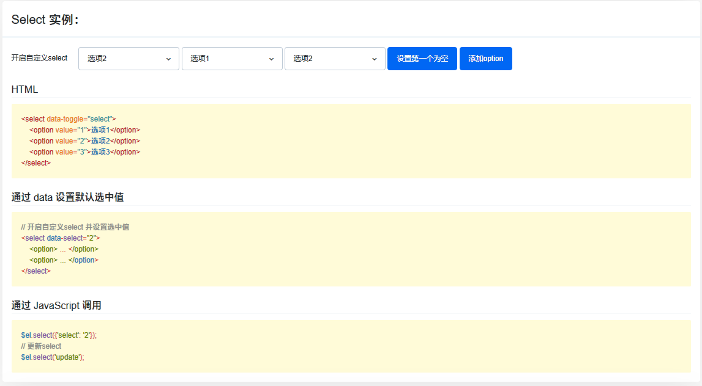
* #### Tabs
  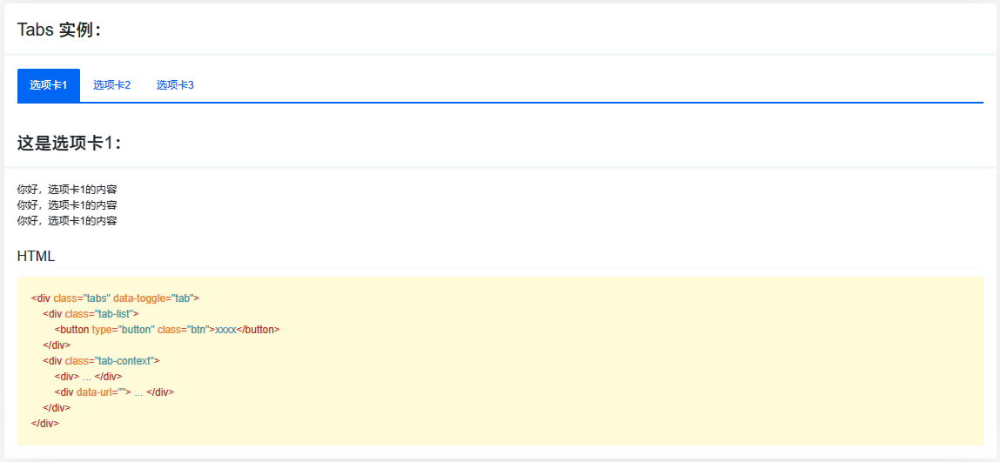
* #### Msgbox
  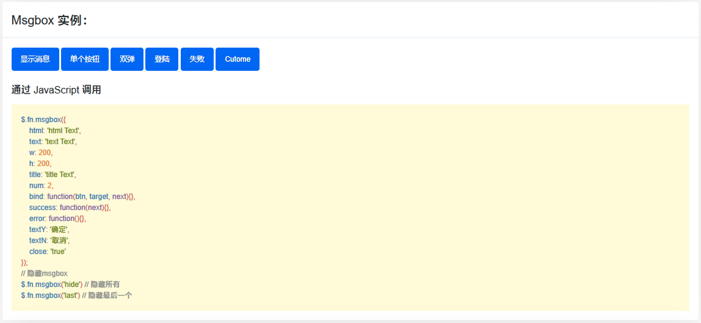
* #### Toast
  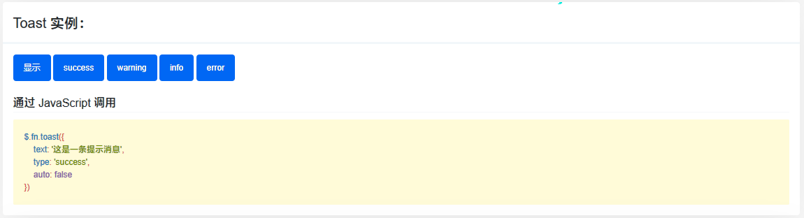
* #### Imgbox
  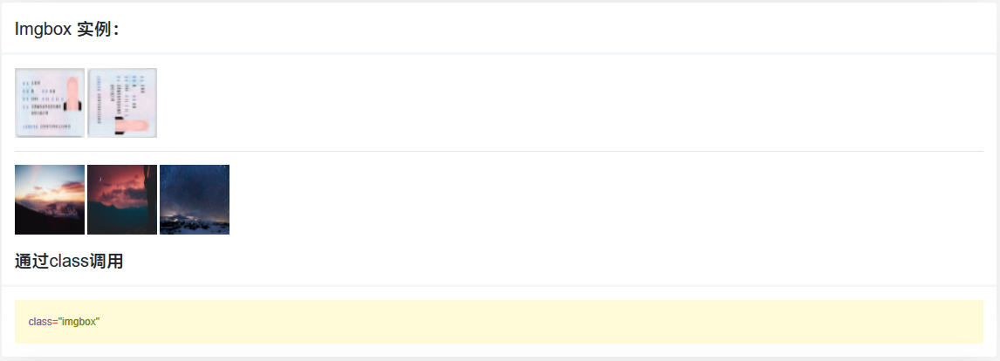
* #### Imgup
  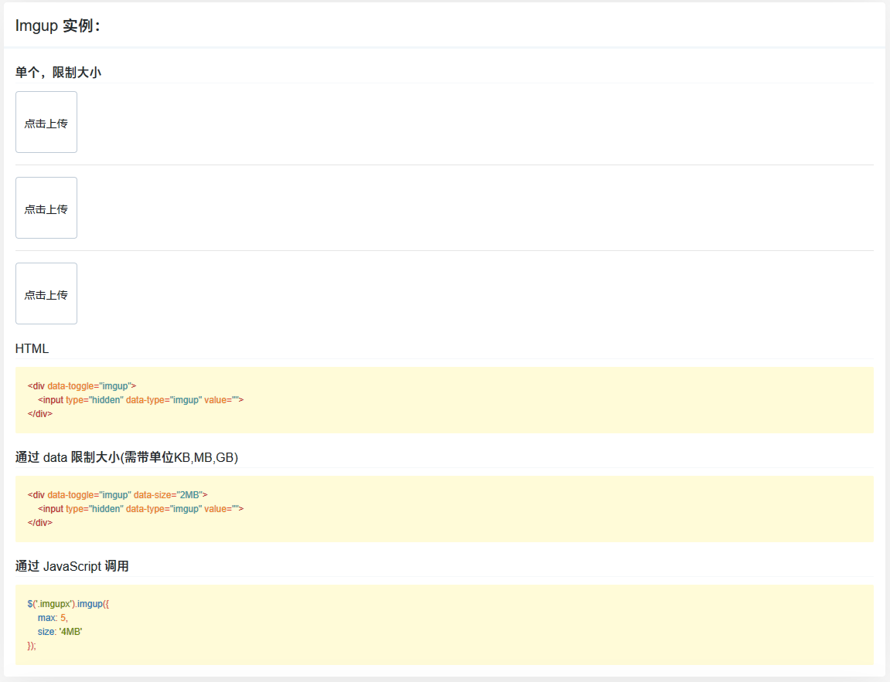
* #### Validate
   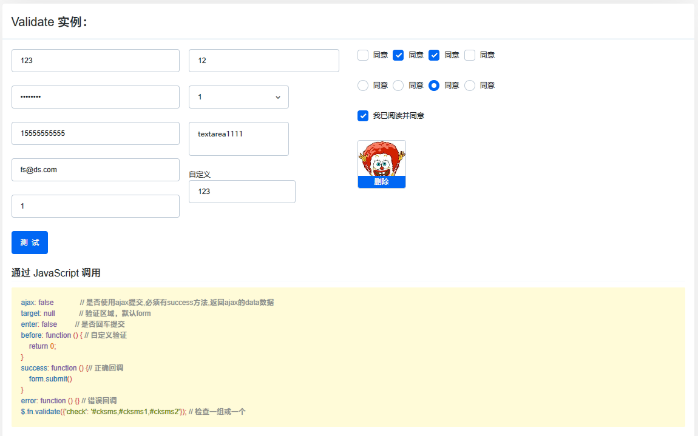
* #### City
   
* #### Page
   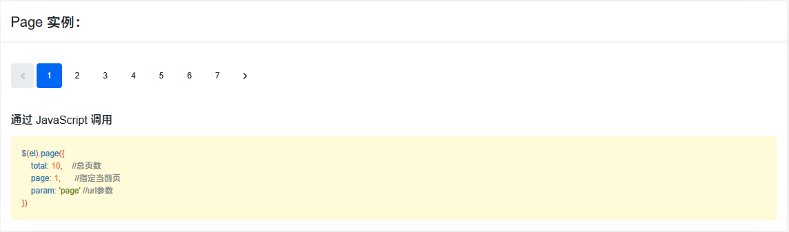
* #### Slider
   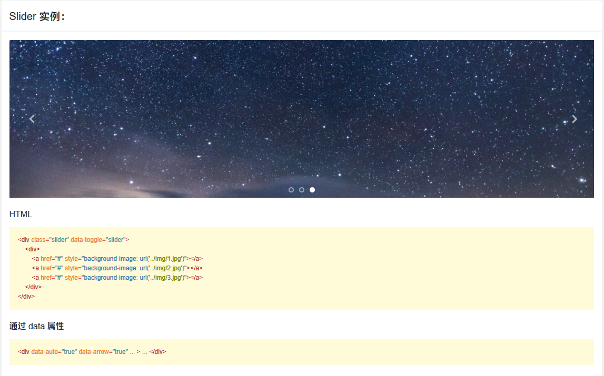
* #### Accordion
   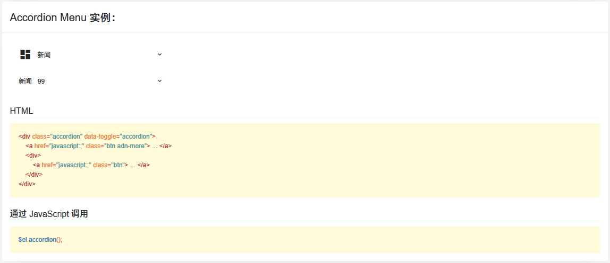
* #### Grade
   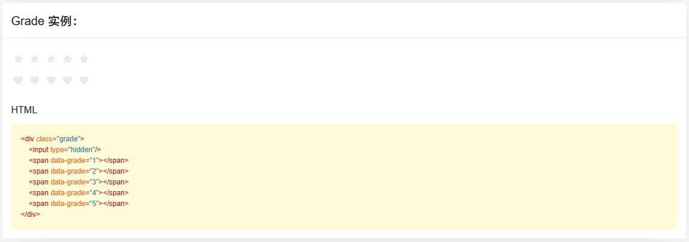
* #### Tags
   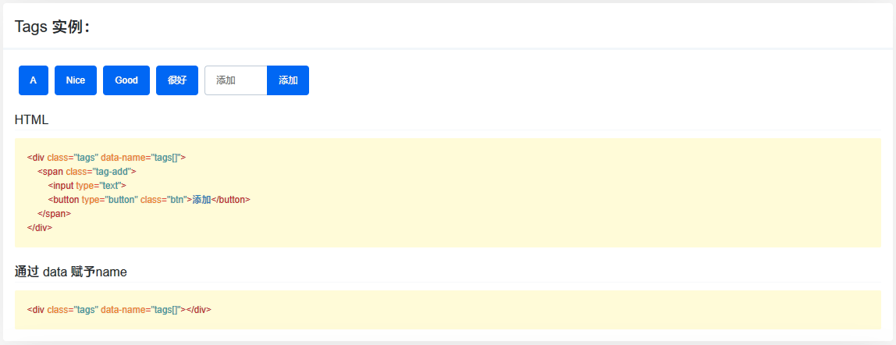

### UI

* #### Checkbox & Radio
  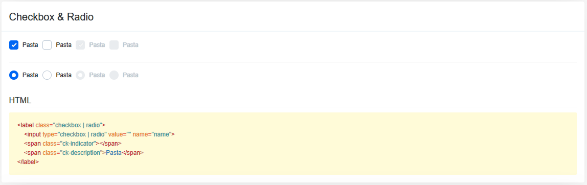
* #### Toggle
  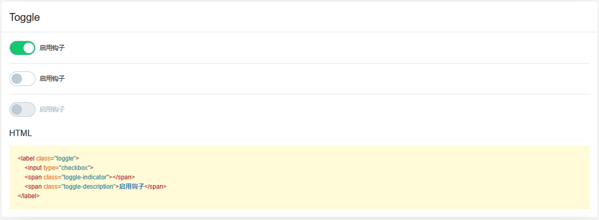
* #### Input
  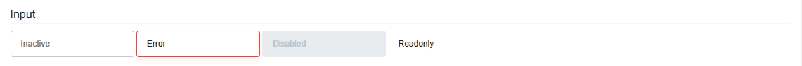
* #### Button
  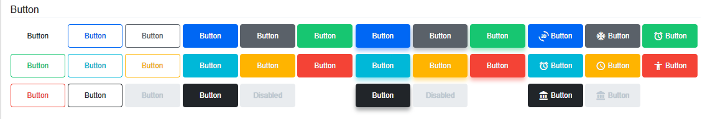
* #### Table
  
* #### Colors
  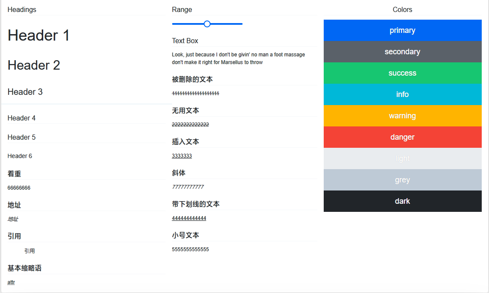