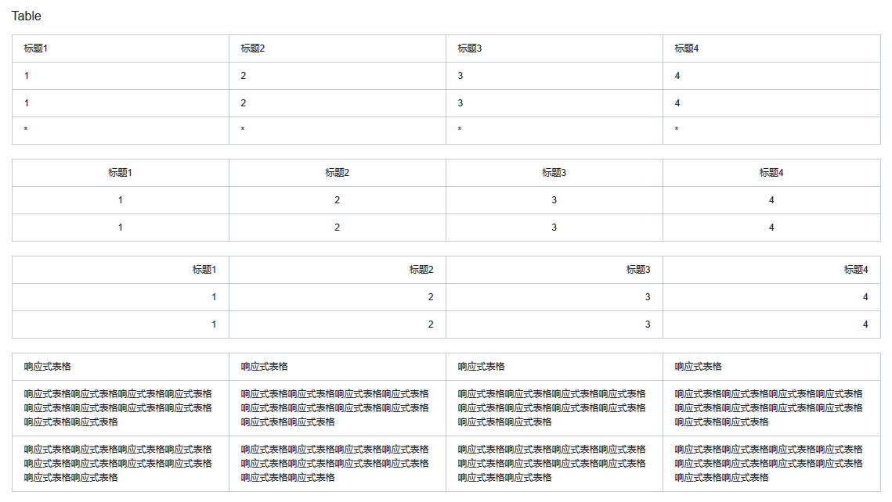

# Onecore

> 浏览器支持

IE9+

> 功能介绍

1. 栅格系统

2. Tip

3. Dropmenu

4. Datepicker

5. Select

6. Tabs

7. Msgbox

8. Toast

9. Imgbox

10. Imgup

11. Validate

12. City

13. Page

14. Slider

15. Accordion

16. Grade

17. Tags

> UI

1. Checkbox & Radio

2. Toggle

3. Input

4. Button

5. Table

6. Colors
